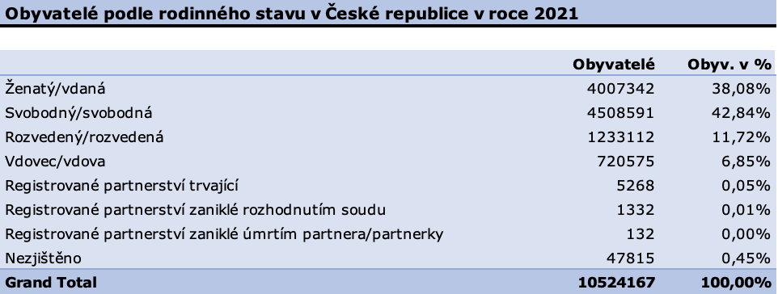
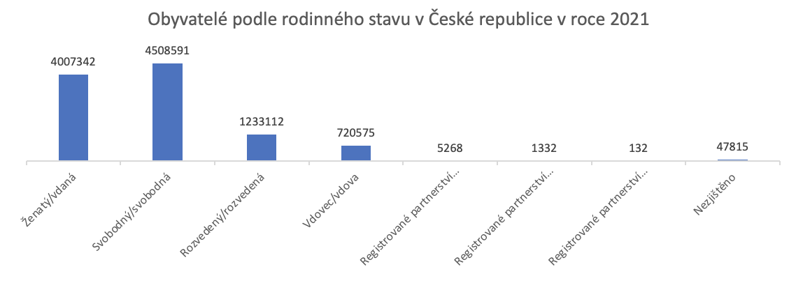
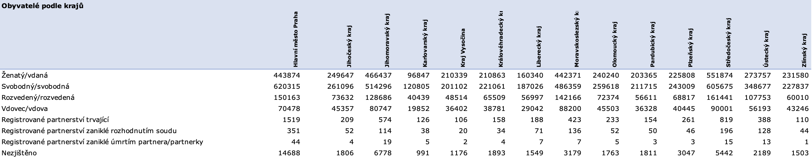
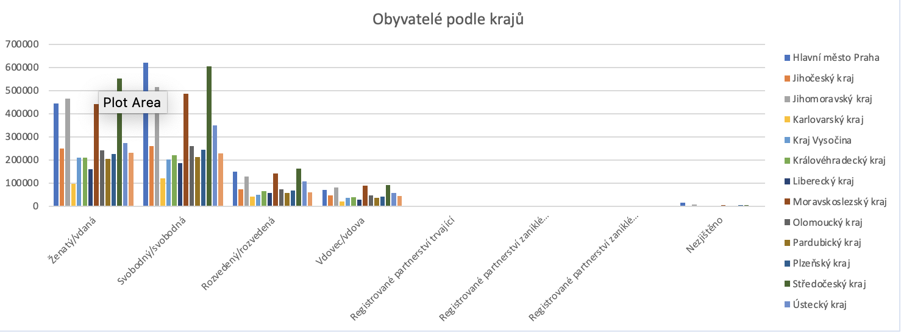

#Excel report projekt

##Obyvatelé v České republice podle rodinného vztahu

Odkaz na můj **Linkedln** [ZDE](https://www.linkedin.com/in/mat%C4%9Bj-frol%C3%ADk-183812230/)   

-------


###Úvod do projektu
Cílem projektu je zobrazit v jednotlivých tabulkách a grafech **rozdělení obyvatel podle rodinného** vztahu v České republice a jednotlivých krajích České republiky.

###Jednotlivé kroky projektu
1. Získání potřebných datových sad z portálu _data.gov.cz_ v souboru CSV.
2. Načtení dat do excelu a jejich následná úprava v Power Query do potřebné formy. Tzn. odstranění nepotřebných sloupců a navázání dvou tabulek pomocí **VLOOKUP** (SVYHLEDAT), kdy získáme jednotlivé kraje a zároveň se zbavíme nulových (erorr) hodnot:
3. Grafická úprava sheetu (listu) s názvem **report**.
4. Vytvoření jednotlivých **pivot tables** (tabulek) s potřebnými údaji pro zjištění počtu obyvatel podle rodinného stavu pro Českou republiku a kraje.
5. Vytvoření **sliceru** (průřezu) pomocí krajů na úvodní pivot tabulku.  
5. Vytvoření **pivot column charts** a **pivot pie charts** (sloupcové a výsečové grafy)pro grafické zobrazení počtu obyvatel podle rodinného stavu.
6. Conditional formating (podmíněné formátování) pro pivot tabulku zobrazující jednotlivé kraje.
7. Vytvoření sheet2 (listu 2 s názvem detail na obce), který nám ukazuje jednotlivé **porovnání rodinného stavu ve městech a obcích Čr**. Přidány rectangle shapes (obdelníkový tvar) sloužící jako tlačítko pro přepínání mezi jednotlivými listy reportu. 
8. Závěrečná grafická úprava celého reportu.

Navázání dvou tabulek (uzemi_kod pro obě dvě tabulky shodný, data_kraj znázorňuje tabulka obsahující kraje ČR dle územních kódů, č. 2 značí druhý sloupec obsahující názvy krajů):
```
   =IFERROR(VLOOKUP([@[uzemi_kod]];data_kraj;2;FALSE);"neurceno")
```
Filtrování nulových hodnot, v dané tabulce souhrnné hodnoty po jednotlivá území:
```
   =IF([@[stav_txt]]<>"";1;0)
```

Obě jednotlivé úpravy lze ošetřit při manipulaci s daty v power query pomocí filtrů a merge queries (sloučení dotazů).

<br /><br />

###Grafické znázornění rodinného stavu v Čr a krajích v roce 2021


<br />


